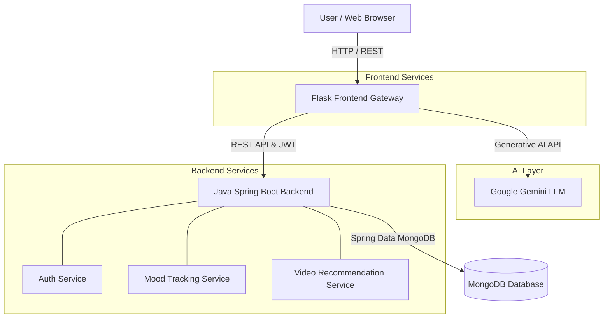

# TheraScape: AI-Powered Therapy Assistant

      

## Project Overview

TheraScape is a microservice-based AI therapy assistant designed to provide emotional support, mood tracking, and personalized therapeutic video recommendations. It serves individuals seeking on-demand mental health tools and crisis management strategies. The system leverages Google's Gemini LLM for dynamic, context-aware conversational therapy and a robust Java Spring Boot backend for secure data persistence, user management, and algorithmic video curation. The platform processes emotional signals in real-time to adjust therapeutic techniques, achieving a personalized mental health care experience.

## Architecture Diagram



## Key Features

* **Context-Aware AI Chatbot** — Conversational agent powered by Google Gemini and LangChain that maintains session history to provide dynamic emotional support.
* **Real-Time Mood Analysis** — Evaluates user inputs for emotional context, categorizing them into predefined mood states and extracting intensity scores to guide responses.
* **Algorithmic Video Recommendations** — Curates therapeutic video content (e.g., mindfulness, breathing exercises) based on the user's current emotional state, historical preferences, and crisis risk.
* **Secure User Authentication** — JWT-based authentication system managed by Spring Security, ensuring private conversations and secure storage of mood history.
* **Crisis Management Protocols** — Automatically detects high-risk language (crisis risk) and routes users to appropriate safe content and emergency strategies.

## Tech Stack

| Layer | Technologies |
|-------|--------------|
| **Frontend Gateway** | Python 3, Flask 3.1.1, HTML/CSS/JS, Jinja2 |
| **Backend Services** | Java 17, Spring Boot 3.5.3, Spring Security, JWT |
| **Database** | MongoDB (Spring Data MongoDB) |
| **AI / ML** | Google Generative AI (Gemini), LangChain |
| **Build & Tooling** | Maven, dotenv, CORS |

## Project Structure

```text
TherapyBot/
├── TherScape1/                    # Python Flask Frontend Gateway
│   ├── app/
│   │   ├── models/                # LLM & Mood Analysis logic
│   │   ├── services/              # API Clients for Java Backend
│   │   ├── static/                # CSS, JS assets
│   │   ├── templates/             # HTML Jinja2 templates
│   │   └── routes.py              # Flask API Endpoints
│   ├── config.py                  # Environment & Feature flags
│   ├── run.py                     # Flask application entry point
│   └── requirements.txt           # Python dependencies
├── therascape-backend/            # Java Spring Boot Backend
│   ├── src/main/java/tech/sumithmeena/therascapebackend/
│   │   ├── controller/            # REST API Controllers (Auth, Mood, Video)
│   │   ├── model/                 # MongoDB Document Entities
│   │   ├── repository/            # Spring Data Repositories
│   │   ├── security/              # JWT & Spring Security configs
│   │   └── service/               # Business logic layer
│   └── pom.xml                    # Maven configuration
└── README.md                      # Global Documentation
```

## API Reference

### Flask Gateway (Frontend -> User)
| Method | Endpoint | Description | Auth Required |
|--------|----------|-------------|---------------|
| POST | `/chat` | Sends user message, triggers AI response & mood analysis | Yes/Demo |
| POST | `/api/login` | Proxies login to Java backend, establishes Flask session | No |
| POST | `/api/register` | Proxies registration to Java backend | No |
| GET | `/api/scene-recommendations/<mood>` | Fetches recommended therapeutic scenes | No |
| POST | `/api/mood-analysis` | Performs explicit mood analysis and returns intensity | No |
| POST | `/clear_conversation` | Wipes current chat session state | Yes |

### Java Backend (Flask -> Backend)
| Method | Endpoint | Description | Auth Required |
|--------|----------|-------------|---------------|
| POST | `/api/auth/login` | Authenticates user and returns JWT | No |
| POST | `/api/auth/register` | Creates a new user record | No |
| POST | `/api/mood/analyze` | Stores new mood entry | Yes |
| GET | `/api/enhanced-videos/personalized/{username}` | Fetches user-specific curated videos | Yes |
| GET | `/api/enhanced-videos/quick-help/{moodCategory}`| Fetches immediate relief videos based on mood | No |
| POST | `/api/enhanced-videos/interaction` | Logs user engagement with a specific video | Yes |

## Database Schema (MongoDB)

### `users` Collection
| Column | Type | Attributes |
|--------|------|------------|
| `id` | String | `@Id` |
| `username` | String | `@Indexed(unique = true)` |
| `email` | String | `@Indexed(unique = true)` |
| `password` | String | Hashed |
| `active` | Boolean | Default: true |

### `mood_entries` Collection
| Column | Type | Description |
|--------|------|-------------|
| `id` | String | `@Id` |
| `user` | DBRef | Reference to `users` collection |
| `primaryMood` | String | Categorized mood (e.g., anxious, stressed) |
| `intensity` | Integer | Scale of 1-10 |
| `crisisRisk` | Boolean | Flags potential mental health crises |
| `timestamp` | Date | Time of entry creation |

### `enhanced_videos` Collection
| Column | Type | Description |
|--------|------|-------------|
| `id` | String | `@Id` |
| `videoUrl` | String | Source URL of the therapeutic video |
| `primaryMoodCategory` | String | Target emotion (e.g., sad, angry) |
| `therapyTechnique` | String | e.g., mindfulness, breathing_exercises |
| `crisisSafe` | Boolean | Safe for users in high-distress states |

## Environment Variables

### Python Gateway (`TherScape1/.env`)
| Variable | Description | Example |
|----------|-------------|---------|
| `GOOGLE_API_KEY` | Gemini API token for AI generation | `AIzaSy...` |
| `SECRET_KEY` | Flask session encryption key | `super-secret-key` |
| `JAVA_BACKEND_URL` | Base URL for Spring Boot backend | `http://localhost:8080` |
| `ENABLE_JAVA_BACKEND` | Feature flag to proxy to backend | `true` |

### Java Backend (`therascape-backend/src/main/resources/application.properties` or `.env`)
| Variable | Description | Example |
|----------|-------------|---------|
| `SPRING_DATA_MONGODB_URI` | MongoDB connection string | `mongodb://localhost:27017/therascape` |
| `JWT_SECRET` | Secret key for token generation | `base64-encoded-secret` |

## Getting Started

### Prerequisites
- Python 3.11+
- Java 17
- Maven
- MongoDB (running locally on port 27017)

### Installation & Running Locally

1. **Start MongoDB**
   Ensure your local MongoDB instance is running.

2. **Run Java Backend**
   ```bash
   cd therascape-backend
   ./mvnw spring-boot:run
   ```
   *The backend will start on `http://localhost:8080`.*

3. **Run Python Gateway**
   ```bash
   cd TherScape1
   python -m venv venv
   source venv/bin/activate  # Or `venv\Scripts\activate` on Windows
   pip install -r requirements.txt
   
   # Set up your .env file
   cp .env.example .env
   # Add your GOOGLE_API_KEY to .env
   
   python run.py
   ```
   *The frontend will start on `http://localhost:5000`.*

## Known Limitations

- Real-time interaction latency is dependent on the external Gemini API response times.
- The `mood_scene_mapper` currently relies on predefined heuristic rules and static embeddings rather than a dynamically trained sequence classification model.
- No rate limiting is currently implemented on the Flask public endpoints.
- MongoDB deployment assumes a local instance and lacks a formal migration or seeding script for the `enhanced_videos` collection in fresh environments.

## Future Improvements

- Implement Redis caching for frequently accessed video recommendations to reduce backend load.
- Deploy services using Docker Compose for unified environment orchestration.
- Add comprehensive pytest coverage for Flask routes and JUnit/Mockito tests for Spring Boot services.
- Transition mood classification to a fine-tuned HuggingFace transformer model for more nuanced emotional context extraction.

## Author
[Abhishek Pandey](https://github.com/Abhishek-Pandey786)
